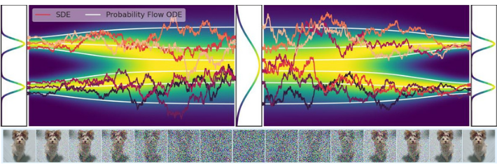

## **Advanced Machine Learning**

### SCORE-BASED GENERATIVE MODELING THROUGH STOCHASTIC DIFFERENTIAL EQUATIONS
 by Yang Song et al.

**Maziane  Yassine**
**Ural Seyfullah**

---
# Motivation of generative modeling

- What is it?
- Why do we need it?
- A bit of history (GAN's, VAE's, ...)
---

# Generative Modeling

Process of generating data from noise.

* Data augmentation 
* Anomaly detection
* Image/Audio synthesis
* Colorization 
* ...

---
# GANs and VAEs
## Generative adversarial networks (GANs)

<!--
- Generator network
     - Genearte new data with similar distribution with original data.
- Discriminator network
    - Differentiate generated data from real data -->

---
# GANs and VAEs
## Variational autoencoders (VAEs)

<!--
 - Encoder network
    - Map data to latent space
- Decoder network
    - Map data to original space  
    
Latent space is not fixed.
-->

---

# Related work
### Related work 1 : Generative Modeling by Estimating Gradients of the Data Distribution (Song et al.)
**Contributions** : Generate synthetic data through annealed Langevin Dynamics

### Related work 2 : Denoising Diffusion Probabilistic Models (Ho et al.)
**Contributions** : Generate synthetic data through diffusion models

---
## Related work 1
**Goal of the paper** : Answer  the following question
How would you generate new data given a data set of i.i.d samples $\{\textbf{x}_i \in \mathcal{R}^D\}_{i=1}^{N}$ drawn from an unknown data distribution $p_{data}(\textbf{x)}$ ?

---
## Related work 1
### PDF modelling
**Simple idea** :  Model the data distribution

---
### PDF modelling
Data distribution is very complex and high dimensional -> Use a deep NN for the density $f_{\theta}(\textbf{x})$.
Since NN is not defined positive we model the data distribution by :
$$p_{\theta}(\textbf{x}) = \frac{e^{f_{\theta}(\textbf{x})}}{Z_{\theta}}$$
And thus
 $$\begin{equation}
    Z_{\theta} = \int_{}^{}e^{f_{\theta}(\textbf{x})} \textbf{dx}
\end{equation}$$

---
### PDF modelling
Problem : this integral is completely ***intractable*** as it integrates over all possible images

Solution : Get rid of the normalization constant by taking the gradient of the log-density
$$\begin{equation}
    \nabla_{\textbf{x}} log(p_{\theta}(\textbf{x})) = \nabla_{\textbf{x}} f_{\theta}(\textbf{x}) - \nabla_{\textbf{x}} log(Z_{\theta}) = \nabla_{\textbf{x}} f_{\theta}(\textbf{x})
\end{equation}$$
The normalization constant is gone and we no longer have a direct access to the distribution but we now have the score

---
### Langevin Dynamics
Sampling from high-density regions can be done by following the score.
**Idea** : Start from a random position in the sample space and follow the score until you arrive at a high-density region, sort of a gradient ascent in the image space.

**Langevin dynamics** : 

$$x_{t+1} = x_t + \frac{\epsilon_t}{2}\nabla_x\log p(x_t) + \sqrt{\epsilon_t}\,z_t$$
We simply need a good score approximator to generate samples!

---
### Score estimation
Let $s_{\theta}(\textbf{x}) \approx \nabla_{\textbf{x}} log(p_{\theta}(\textbf{x}))$ be a NN where $s_{\theta}(\textbf{x})$ : $\mathcal{R}^D \to \mathcal{R}^D$
We minimize the $\mathcal{L}_2$ norm of the vector difference, so-called "Fisher divergence"
$$\begin{equation}
    \theta^* = \underset{\theta}{arg min} E_{p_{data(x)}}[\lVert \nabla_{\textbf{x}} log(p_{\theta}(\textbf{x})) - s_{\theta}(\textbf{x}) \rVert_2^2]
\end{equation}$$
We do not know the true $\nabla_{\textbf{x}} log(p_{\theta}(\textbf{x}))$ but Hyvärinen showed this objective is equivalent to
$$\begin{equation}
    \theta^* = \underset{\theta}{arg min}E_{p_{data(x)}}[ tr(\nabla_{\textbf{x}} s_{\theta}(\textbf{x})) +  \lVert \frac{1}{2} s_{\theta}(\textbf{x}) \rVert_2^2]
\end{equation}$$

---
### Results

---
### Pitfalls
**Manifold hypothesis** :  high-dimensional data lie on low-dimensional manifolds within the high-dimensional space.

---
### Pitfalls
Our data set samples occupy an absurdly small fraction of the space thus our score is a good approximation almost nowhere.
Why ?
* The noisy samples that occupy the space are not part of the Monte-Carlo expectation approximation
* Inaccurately approximating the score in their neighbourhood is thus not a big deal

---
### Pitfalls

---
# Solution
**ADDING SEVERAL LEVELS OF NOISE** to enlarge the support of the distribution
**ADDING SEVERAL LEVELS OF NOISE** to enlarge the support of the distribution
**ADDING SEVERAL LEVELS OF NOISE** to enlarge the support of the distribution
**ADDING SEVERAL LEVELS OF NOISE** to enlarge the support of the distribution
**ADDING SEVERAL LEVELS OF NOISE** to enlarge the support of the distribution

---
### Annealed Langevin Dynamics

---
### Results

Far better than before

---
Leave blank

---
## Related work 2
**Goal of the paper** : Answer  the following question
How would you generate new data given a data set of i.i.d samples $\{\textbf{x}_i \in \mathcal{R}^D\}_{i=1}^{N}$ drawn from an unknown data distribution $p_{data}(\textbf{x)}$ ?

---
### Big picture
Diffusion models aim at learning the reverse of the noise generation procedure :
* Forward process : Add noise to the original sample $x_0$ such that converges to $x_T$ gaussian
* Backward process : Recover the original sample from the noise 

---
### Big picture

source : "https://lilianweng.github.io/posts/2021-07-11-diffusion-models/"

---
### How it works
We consider a sequence of positive increasing noise scales and for each data point we construct a discrete markov chain
 {$x_0, x_1, x_2, ..., x_T$} such that $x_T$ can be considered fully gaussian for large T.

The backward process defines a variational Markov chain in the reverse direction that constructs {$x_T, x_{T-1}, ..., x_1, x_0$} such that they are sampled from $p_{\theta}(x_{t-1}|x_{t})$

---
### Markov chains definition
The forward process is defined by : $q(x_t | x_{t-1}) = N(x_t; μ_t = (1-β_t)x_{t-1}, Σ_t = β_tI)$

The backward process is defined by : $p_θ(x_{t-1} | x_t) = N(x_{t-1}; μ_θ(x_t, t), Σ_θ(x_t, t))$ 

Ideally we would like our model $p_{\theta}(x_{t-1}|x_t)$to learn the distribution $q(x_{t-1}|x_{t})$.

Note : by Bayes $q(x_{t-1}|x_{t})$ is intractable.

---
### Training 
What  loss to use between distributions ? KL divergence 
**Loss** : $E_q[D_{KL}(q(x_{t-1}|x_t,x_0)||p_{\theta}(x_{t-1}|x_t))]$

Or equivalently 

$E_{x_0,\epsilon,t}[||\epsilon - \epsilon_{\theta}( \sqrt{\bar{\alpha_t}}x_0 + \sqrt{1-\bar{\alpha_t}}\epsilon,t)||^2]$

---
Leave blank

---

## Back to our paper

---
# Stochastic Differential Equations
<!-- Mathemathical model / equation  -->

### Diffusion Process

$$
\mathrm{d} \mathbf{x}=\textcolor{green}{\mathbf{f}(\mathbf{x}, t)} + \textcolor{red}{g(t)\mathrm{d}\mathbf{w}}
$$
with :
* $\mathbf{w}$ the standard Weiner process (Brownian motion),
* $\mathbf{f}(.,t) : \mathbb{R}^d \to \mathbb{R}^d$  the drift coeffitient of $x(t)$
* $g(.) : \mathbb{R} \to \mathbb{R}$ diffusion coefficient

---
# Diffusion process 

* $p_0$ is data distribution 
* $p_t$ is the prior distribution

---

### Anderson Backward process
Forward SDE : maps $p_{data}(x)$ -> $p_{prior}(x)$ 
$$d\mathbf{x} = \mathbf{f}(\mathbf{x},t)dt + g(t)d\mathbf{w}$$ 

Anderson showed there exists a corresponding SDE that goes in the opposite direction.

Reverse-time SDE : maps $p_{prior}(x)$ ->  $p_{data}(x)$ 

$$d\mathbf{x} = [\mathbf{f}(\mathbf{x},t) - g(t)^2 \nabla_{\mathbf{x}} log(p_t)]dt+ g(t)d\mathbf{\bar w}$$ 

---
### 2 SDE's

WARNING : THE SDE'S MAP DISTRIBUTION NOT SAMPLES

---
### Estimating the score
Generating samples requires knowing the score of each marginal distribution but once again we don't have it. We thus resort to estimation.

**Problem** : The marginal $p_t(x_t)$ is once again intractable but the conditional $p_t(x_t|x_0)$ is fully tractable, why ? It vastly reduces the set of trajectories to consider and we have a closed form for the conditionnal.

---
### Estimating the score
**Theorem** : Any SDE with affine drift function f(x,t) has a gaussian transition kernel $p_{t+1}(x_{t+1}|x_t)$ .[Section 5.5 in Särkkä & Solin (2019)]

**Consequence** : $p_t (x_t|x_0)$ is gaussian as well by a property of gaussians.

---
### Estimating the score
Considering a score network $\mathbf{s_{\theta}}(x,t)$ : 
$$\begin{equation}
 \mathbf \theta^* = \text{arg min } {E_tE_{x_0}E_{x_t|x_0}[\lambda (t)||\mathbf{s_{\theta}}(x,t)- \nabla_{x_t}log p_t(x_t|x_0)||^2} 
\end{equation}$$

Training is a 4-step procedure : 
* Sample a timestep in [0,T] and an image $x_0$
* Diffuse it either by simulating the SDE or by the underling gaussian kernel
* Compute the loss
* Backpropagate 

---
### Conditionnal and marginal score 
Even though we approximate the conditional score, at optimality $s_{\theta}(x,t)=\nabla_x log(p_t(x))$, i.e, we approximated the marginal score.

Why ? For 2 reasons : 
* We average over all $x_0$ of the data set

* The network is given a noisy sample $x_t$ which could come from several $x_0$'s, the network averages over these.

NB: $\lambda (t)$ thus has large importance

---
### Unifying framework
How does this paper relate to the two papers reviewed in the related work section ?
In the first paper, the noise perturbation kernel $p_{\sigma}(x_i|x_{i-1})$ followed :
$$x_i = x_{i-1} + \sqrt{\sigma_i^2-\sigma_{i-1}^2}z_{i-1}$$
Which can be written as the following SDE
$$dx = \sqrt{\frac{d\sigma^2(t)}{dt}}dw$$

---
### Unifying framework
In the second paper, the noise perturbation kernel was given by the forward process $p_{\beta}(x_i|x_{i-1})$ followed : 
$$x_i = \sqrt{1-\beta_i}x_{i-1}+ \sqrt{\beta_i}z_{i-1}$$
Which can be written as the following SDE
$$dx = -\frac{1}{2}\beta(t)xdt + \sqrt{\beta(t)}dw$$
And sampling can be done for both by reversing the SDE and estimating the score.

---
### Unifying framework
An interesting result in this framework : consider the training loss 
$${E_tE_{x_0}E_{x_t|x_0}[\lambda (t)||\mathbf{s_{\theta}}(x,t)- \nabla_{x_t}log p_t(x_t|x_0)||^2}$$
Reparametrization trick :  $x_t = \gamma_t x_0 + \sigma_t \epsilon$
Score function : $\nabla_{x_t}log p_t(x_t|x_0) = -\nabla_{x_t}\frac{(x_t-\gamma_t x_0)^2}{\sigma_t^2}=-\frac{x_t-\gamma_t x_0}{\sigma_t^2}=-\frac{\gamma_t x_0 + \sigma_t \epsilon-\gamma_t x_0}{\sigma_t^2}=-\frac{\epsilon}{\sigma_t}$

Under this SDE, the network is simply tasked to learn the added noise, as in DDPM.

---
### Numerical solvers
Sampling can now be done by:
* Predictor method  simply simulating the reverse-time SDE, equivalently, solving the SDE under a Euler-Maruyama scheme or even use a more advanced solver such as RK45.
* Predictor-Corrector method : the corrector refines the prediction of the predictor by taking advantage of known information

---
### Numerical solvers 
Specifically, the PC method takes advantage of the known score $\nabla_{x_t}log p_t(x_t)$.
The procedure is as follows :
1. Take a backward step according to the reverse-time SDE (temporally)
2. Take a few steps in the gradient direction to move towards high-density regions (geographically)

NB : Make the plane analogy

---
### Numerical solvers 
Quantitatively, in terms of FID score, the PC samplers outperfom the P samplers by a large margin

---
### Numerical solvers 
Qualitatively, the PC samplers outperform the P samplers

---
### Numerical solvers 
Predictor methods might be of poor quality and computationally suboptimal

---
Leave blank

---
# Probability flow ODE
Sare same marginal probability densities $\{p_t(\mathbf{x})\}^T_{t=0}$ as the SDE

$$
\mathrm{d} \mathbf{x}=\left[\mathbf{f}(\mathbf{x}, t)-\frac{1}{2} g(t)^{2} \textcolor{brown}{\nabla_{\mathbf{x}} \log p_{t}(\mathbf{x})}\right] \mathrm{d} t,
$$
$$
\textcolor{brown}{\nabla_{\mathbf{x}} \log p_{t}(\mathbf{x}) \longrightarrow \text{ score function of } p_{t}(\mathbf{x})}
$$
## Approximation with score based model
$$
\nabla_{\mathbf{x}} \log p_{t}(\mathbf{x}) \approx \mathbf{s}_{\theta}(\mathbf{x},t)
$$
---
# Probability flow ODE

## Approximation with score based model

$$
\mathrm{d} \mathbf{x}=\left[\mathbf{f}(\mathbf{x}, t)-\frac{1}{2} g(t)^{2}\mathbf{s}_{\theta}(\mathbf{x},t) \right] \mathrm{d} t,
$$

* Exact likelihood computation
* Manipulating latent representations
* Uniquely identifiable encoding
* Efficient sampling

---

# Controllable generation
$\mathbf{y}$ is the controll signal

$$
\mathrm{d} \mathbf{x}=\left[\mathbf{f}(\mathbf{x}, t)-g(t)^{2} \color{red}{\nabla_{\mathbf{x}} \log p_{t}(\mathbf{x} \mid \mathbf{y})}  \right] \mathrm{d} t+g(t) \mathrm{d} \overline{\mathbf{w}}
$$
* $\textcolor{red}{\text{Unknown}}$

---
# Controllable generation

$$
\mathrm{d} \mathbf{x}=\left\{\mathbf{f}(\mathbf{x}, t)-g(t)^{2}\left[\color{orange}{\nabla_{\mathbf{x}} \log p_{t}(\mathbf{x})} \color{black}{+} \color{green}{\nabla_{\mathbf{x}} \log p_{t}(\mathbf{y} \mid \mathbf{x})}\right]\right\} \mathrm{d} t+g(t) \mathrm{d} \overline{\mathbf{w}}
$$
* $\textcolor{orange}{\text{Unconditional score, same as before}}$
* $\textcolor{green}{\text{Trained separately or specified with domain knowledge}}$

---
# Controllable generation
$\mathbf{y}$ is the class label
$p_{t}(\mathbf{y} \mid \mathbf{x})$ is a time dependant classifier

 
Class conditional samples on 32x32 CIFAR10, automobiles on the left and horses on the right.

---
# Controllable generation
$\mathbf{y}$ is the masked image
$p_{t}(\mathbf{y} \mid \mathbf{x})$ can be approximated without training

 Impainting on 256x256 LSUN, first column is orginal image, second is masked image, remaining are sample image completions.

---
# Controllable generation
$\mathbf{y}$ is the grey scale image
$p_{t}(\mathbf{y} \mid \mathbf{x})$ can be approximated without training

Colorization on 256x256 LSUN, first column is orginal image, second is grey scale image, remaining are sample image colorizations.

---

## Critics
* A useful framework but many papers ignore it
* A well designed numerical solver 
* Hardly computable likelihood without rough approximation

--- 

# Sources

https://lilianweng.github.io/posts/2021-07-11-diffusion-models/
https://www.slideshare.net/sangwoomo7/introduction-to-diffusion-models
https://yang-song.net/blog/2021/score/