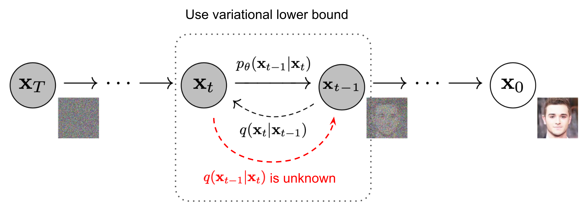

## **Advanced Machine Learning**

### Unsupervised Representation Learning from Pre-trained Diffusion Probabilistic Models
 by Zijian Zhang, Zhou Zhao and Zhijie Lin

**Maziane  Yassine**

---
# Authors
**Zijian Zhang** : PhD student at Zhejiang University
**Zhou Zhao** : Associate Professor at Zhejiang University
**Zhijie Lin** : Researcher at Sea AI Lab

# Publication journal 
Paper was accepted at Advances in Neural Information Processing Systems 35 (NeurIPS 2022)

---
# Context
The authors propose Pre-traine DPM AutoEncoding (PDAE), a variant of DPM where a latent z holding much information about the data is trained to allow :
* Better reconstruction and higher sample quality
* Learning meaningful representations of the data

---
# Background 
## Diffusion Probabilistic Models : big picture
Diffusion models aim at learning the reverse of the noise generation procedure :
* Forward process : Add noise to the original sample $x_0$ such that converges to $x_T$ gaussian
* Backward process : Recover the original sample from the noise 

---
# Background 
## Diffusion Probabilistic Models  : big picture

source : "https://lilianweng.github.io/posts/2021-07-11-diffusion-models/"

---
# Background 
## Diffusion Probabilistic Models  : Markov chains definition
The forward process is defined by : $q(x_t | x_{t-1}) = N(x_t; μ_t = (1-β_t)x_{t-1}, Σ_t = β_tI)$

The backward process is defined by : $p_θ(x_{t-1} | x_t) = N(x_{t-1}; μ_θ(x_t, t), Σ_θ(x_t, t))$ 

Ideally we would like our model $p_{\theta}(x_{t-1}|x_t)$to exactly learn the distribution $q(x_{t-1}|x_{t})$ but it is intractable by Bayes. 

---
# Background 
## Diffusion Probabilistic Models : training 
What  loss to use between distributions ? KL divergence 
**Loss** : $E_q[D_{KL}(q(x_{t-1}|x_t,x_0)||p_{\theta}(x_{t-1}|x_t))]$

Or equivalently 

$E_{x_0,\epsilon,t}[||\epsilon - \epsilon_{\theta}( \sqrt{\bar{\alpha_t}}x_0 + \sqrt{1-\bar{\alpha_t}}\epsilon,t)||^2]$

---
# Background 
## Classifier-guided Diffusion Probabilistic Models
* Classical DPM's : low control on the generated sample
* Classifier-guided DPM : high control of the class of the generated sample 
Simply push the sample towards high-density region $p(y|x_t)$ .

$p_θ(x_{t-1} | x_t) = N(x_{t-1}; μ_θ(x_t, t) + Σ_θ(x_t, t)\cdot\nabla_{x_t}\log  p(y|x_t), Σ_θ(x_t, t))$

---
# Background 
## Autoencoders
Autoencoders: Unsupervised learning for efficient data representation

* Neural network architecture for learning compact representations
* Consists of an encoder and a decoder
* Encoder maps input data to a lower-dimensional latent space
* Decoder reconstructs the original input from the latent representation

---
# Background 
## Autoencoders

---
# Background 
## Representation Learning
* Extraction and construction of useful representations or features from raw data
* Aims to discover underlying structures and dependencies in the data
* Let the model learn these representations directly from the data rather than relying on handcrafted features designed by humans.

---
# Paper observation  
Authors observed that when diffusing an image and then denoising it, the reconstruction was never perfect regardless of the diffusion time or stochasticity involved, however, the reconstruction could be **improved** by using a **conditionnal** diffusion model.

---
# Class information benefit
It seems the conditionnal gap is smaller than the unconditionnal gap
$$
\begin{equation}
    |\mu_{\theta}(x_t,y,t)-\tilde{\mu_{\theta}}(x_t,x_0) |\leq | \mu_{\theta}(x_t,t)-\tilde{\mu_{\theta}}(x_t,x_0)| 
\end{equation}
$$
And they also observed the better reconstruction experimentally !
Essentially training is about injecting noise and removing it given $(x_t,y,t)$

---

---
# Class information benefit : WHY?
* Why can't unconditionnal DPM's have perfect reconstruction ?
* Why does the class information help reconstruction ?

-->Ask the audience

---

# Class information benefit : WHY?

* Question : Why can't unconditionnal DPM's have perfect reconstruction ?  
Answer :  Reconstruction is never perfect because the forward process **destroys** information. "Temporal latent variables lack high-level semantic information because they are just a sequence of spatially corrupted images."
* Question : why does the class information help reconstruction ?
Answer : Simply because the class label is a **huge semantic information**

---
# Information summary
1) The class label helps filling the gap by shifting the predicted mean by an item $Σ_θ(x_t, t)\cdot\nabla_{x_t}\log  p(y|x_t)$.
2) Even with the class label, reconstruction is not perfect because $y$ does not capture the whole information of $x_0$.
3) In theory, if $y$ contained all information of $x_0$, the gap could be fully filled and the reconstruction would be perfect

---

Big

---
# Main idea and contribution of the paper 
Instead of using class information to fill the gap, **couldn't we inversely extract information about $x_0$ from the gap** ? 
Instead of using y to fill the gap, couldn't we look for the best information summary $z=f(x_0)$ such that the gap is as small as possible ?
If z contains all information about $x_0$, the gap will be fully filled and the reconstruction perfect ... but this goes in the opposite direction as well !

---
# Maths behind
Let $E_{\phi}$ be an AutoEncoder such that $z = E_{\phi}(x_0)$ and $p_{\theta}$ a pre-trained DPM such that $p_{\theta}(x_{t-1}|x_t) = N(x_{t-1}, \mu_{\theta}(x_t,t), \Sigma_{\theta}(x_t,t)$.

The conditionnal-DPM is : 
$p_{\theta,\psi,\phi}(x_{t-1}|x_t,z) = N(x_{t-1}, \mu_{\theta}(x_t,t)+ \Sigma_{\theta}(x_t,t)\cdot G_{\psi}(x_t,z,t), \Sigma_{\theta}(x_t,t))$

Where $G_{\psi}(x_t,z,t)$ simulates $\nabla_{x_t} p(z|x_t)$ where $p(z|x_t)$ is an implicit classifier.

---
# Training
Training = Find an encoder $E_{\phi}$ and a gradient estimator $G_{\psi}$ such that the gap is minimal.

Both models need to be good thus both models are trained jointly with 
$$
\begin{equation}
L(\psi,\phi) = E_{x_0,t,\epsilon}[ \lambda_t||\epsilon-\epsilon_{\theta}(x_t,t)+\frac{\sqrt{\alpha_t}\sqrt{1-\bar\alpha_t}}{\beta_t}\cdot\Sigma_{\theta}(x_t,t)\cdot G_{\psi}(x_t,E_{\phi}(x_0),t)||^2]
\end{equation}
$$ 
where $x_t = \sqrt{\bar\alpha_t}x_0 + \sqrt{1-\bar{\alpha_t}}\epsilon$ and where $\lambda_t$ is a new weighting scheme defined by the authors 

---
# Training

$$
\begin{equation}
L(\psi,\phi) = E_{x_0,t,\epsilon}[ \lambda_t||\epsilon-\epsilon_{\theta}(x_t,t)+\frac{\sqrt{\alpha_t}\sqrt{1-\bar\alpha_t}}{\beta_t}\cdot\Sigma_{\theta}(x_t,t)\cdot G_{\psi}(x_t,E_{\phi}(x_0),t)||^2]
\end{equation}
$$
---
# Network architecture
* $E_{\phi}$ is a simple CNN + 1 FC
* $G_{\psi}(x_t,z,t)$ is a U-Net similar to that of $\epsilon_{\theta}(x_t,t)$ which already takes $x_t$ and $t$ as inputs and thus we can leverage the knowledge of the trained DPM by using the time embedding layer and the encoder part of the U-Net such that in the end we only need to embed z.  

---
# Diffusion timesteps importance
For sample quality reasons, $\lambda_t = 1$ is most often used but authors made an interesting observation : some timesteps matter more than others. Consider the following mixed sampling procedure : 
1) Unconditionally generate a sample from t = T -> $t=t_1$ 
2) Continue with classifier-guided diffusion from $t=t_1$ to $t=t_2$
3) Go back to unconditional diffusion 

---

"We can conclude that the mean shift during critical-stage contains more crucial information to reconstruct the input class label in samples than the other two stages"

---
# Experiments

The latent seems to bring quite a lot of information useful to reconstruction. ("FFHQ128-130M-z512-64M")

---
# Critics
### Pros
* Main concurrent work, diff-AE, had to retrain a whole DPM to achieve similar performance resulting in PDAE requiring 2 to 3 times less training batches.
* Managed to reach attribute manipulation
* Paper is simple to read
* Elegant main idea

---
# Critics
### Cons
* The approximated gradient $G_{\psi}$ might be far from an actual gradient, it is simply there to provide a better noise prediction
* $G_{\psi}$ architecture being more complex than $E_{\phi}$, it might hide the defaults and quality of $E_{\phi}$.
* The conclusion from the mixed samplings is strong, further evidence such as MSE according to the several $(t_1,t_2)$ pairs would have been welcome
* There is no simple decoder as $E_{\phi}^-1$ 

---
# Critics
### Cons
* Training ends up being very unstable to domain shifts (admitted in openreview)
* Limitations themselves are not discussed
* Practical results about representation do not out-perform previous baselines 
The last critic was given by Reviewer 4H5f.
Is this an issue ?